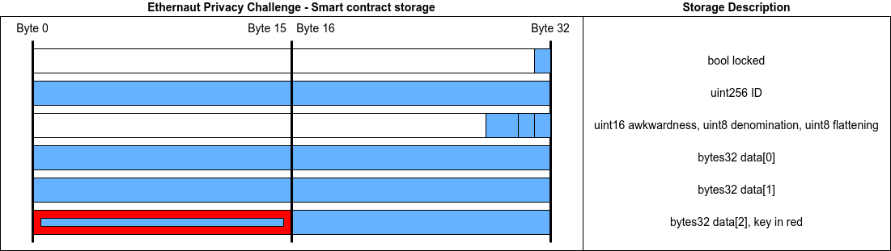

# Ethernaut Solutions
## Introduction
This repository contains all the solution I used to complete the Ethernaut challenges.

:warning: Please do not copy/paste this content to complete Ethernaut challenges. Take time to understand the challenges! :warning:

## Hello Ethernaut
First deploy the contract by clicking "Get new instance".
Then, look at the contract.abi to get smart contract functions.
Call the password() view function, and pass the returned result as parameter to the authenticate() function.

## Fallback
By reading the code, we can identify that the receive() function should be called to get contract ownership. But we need to contribute before calling the receive function (or the call will fail).

So, we need to :
 1. call contribute with less than 0.001 ether as value
 2. call the receive function (by sending some ether)
 3. call the withdraw function

## Fallout
The function Fal1out allow the sender to become the owner of the contract. It is a typographical error, and the comment let us think that it is the constructor function.
But since Solidity v0.5.0, the "constructor" function is used instead of the name of the contract.

## Coin Flip
This coin flip smart contract needs to use a random value. To do so, it uses the block value to calculate a number. As the block value is well known, the calculated number can be predicted and automatically calculated by another smart contract.


## Telephone
The contract require that tx.origin != msg.sender to change owner. This can be easily done using a smart contract to call this function.

## Token
The token contract is vulnerable to an integer underflow. If we have 20 tokens, we can ask to send 21 tokens. Our balance would be -1 if it was a signed integer. As it is unsigned, -1 corresponds to the larger number allowed by the uint256 format.

## Delegation
The objective is to gain ownership of the Delegation contract. To do so, we can exploit the delegatecall. The official Solidity documentation says : 
```
"There exists a special variant of a message call, named delegatecall which is identical to a message call apart from the fact that the code at the target address is executed in the context (i.e. at the address) of the calling contract and msg.sender and msg.value do not change their values."
```
So we can call the pwn function from Delegate contract, but in the context of the Delegation contract. This allows us to take ownership of the contract.


## Force
The goal is to make the balance of the contract greater than zero. To do so, we will use the selfdestruct of another contract to make the balance non-zero.


## Vault
Even if a variable is private, all the datas are public in Ethereum. So we can read the private password and unlock the contract.

## King
This contract does send the prize to the king of the contract. If the king is a smart contract that revert when it receives funds, the king will never change.

## Re-entrancy
On this contract, the vulnerability is that the withdraw function does send the funds before getting the balance updated. Using an attacker smart contract, a re-entrancy attack is possible.


## Elevator
Here, the objective is to set the top variable to true. To do so, it calls the msg.sender to know if top is true or false. We have to develop a smart contract with a isLastFloor() function that returns false during the first call, then true to the second call.

## Privacy
The objective is to unlock the contract. We need to know the key to do this.
Reading the storage of the smart contract will be done using web3.eth.getStorageAt(). We need to deeply understand how smart contracts store data to find the result.
Here is a picture that explains what data should be read :



## Gatekeeper One

TODO

## Gatekeeper Two

TODO

## Naught Coin
This contract locks the transfer function for 10 years. But it is possible to use the approve() and transferFrom() to transfer funds.


## Preservation
We are going to exploit delegatecall(). First, we can see that the LibraryContract does modify the first storage slot, which is the address of the library in the context of the vulnerable contract. So, we are able to modify this address to set it to an attacker contract. Our attacker contract will modify the third slot, to modify the owner address.


## Recovery
TODO


## Magic Number

## Alien Codex

## Denial


## Shop
Here the vulnerable contract calls the Buyer 2 times. It is simple. For first call, the price() function returned value will be 100, the second time it will be < 100.


